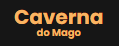

<h1 align="center">
  
</h1>

  <a href="#-tecnologias">Tecnologias</a>&nbsp;&nbsp;&nbsp;|&nbsp;&nbsp;&nbsp;
  <a href="#-projeto">Projeto</a>&nbsp;&nbsp;&nbsp;|&nbsp;&nbsp;&nbsp;
  <a href="#-layout">Layout</a>&nbsp;&nbsp;&nbsp;&nbsp;&nbsp;&nbsp;

 

  

## 🚀 Tecnologias

Esse projeto foi desenvolvido com as seguintes tecnologias:

- HTML
- CSS
- JavaScript

## 💻 Projeto

O site Caverna do Mago é um comercio fictício de alimentos em geral.

## 🔖 Layout

Você pode visualizar o layout do projeto através [desse link](https://www.figma.com/file/cc0lrVWgGXcloZMn6PuGCD/Caverna?node-id=0%3A1). É necessário ter conta no [Figma](https://figma.com) para acessá-lo.

---
